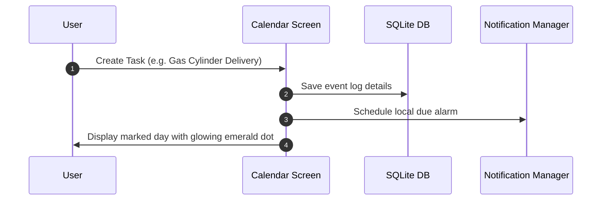
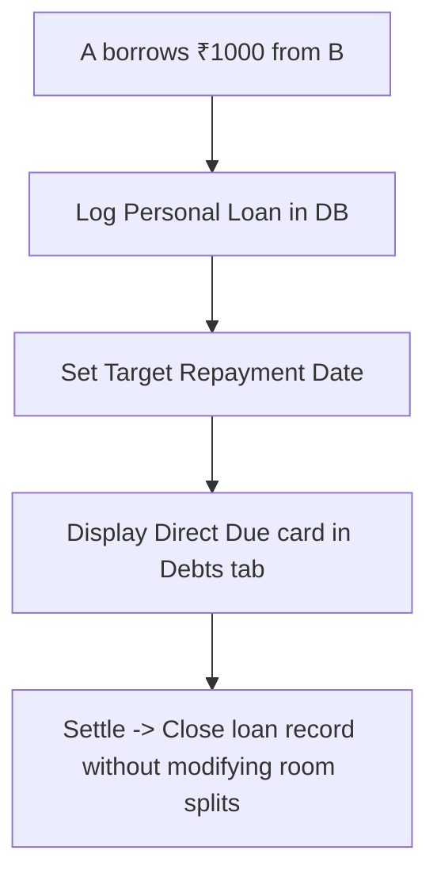
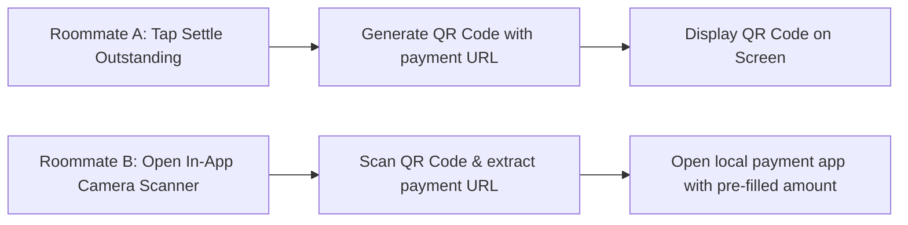
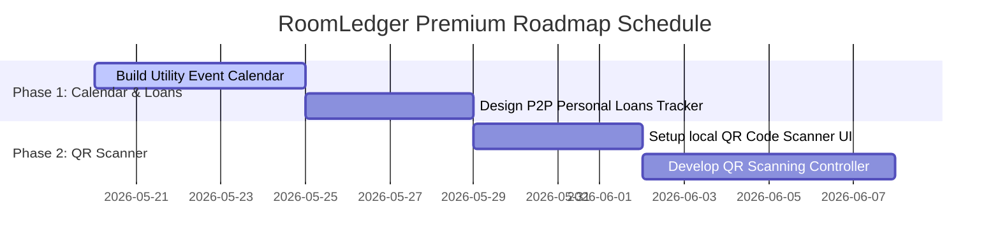

# 🟢 RoomLedger Premium Roadmap & Engineering Plan

Welcome to the **RoomLedger Premium Roadmap & Engineering Plan**. This plan outlines a suite of state-of-the-art, high-value improvements and advanced features designed to elevate **RoomLedger** into a world-class, premium app, while keeping its core philosophy intact: **pure AMOLED aesthetics, 100% offline local privacy, and integer-exact mathematical safety.**

---

## 🧭 Architectural Core & Philosophy

All improvements and new features must conform strictly to RoomLedger's three pillars:

```mermaid
graph TD
    classDef primary fill:#10B981,stroke:#047857,color:#ffffff,stroke-width:2px;
    classDef secondary fill:#1E293B,stroke:#0F172A,color:#94A3B8,stroke-width:1px;
    
    A[RoomLedger Pillars] ::: primary
    A --> B[1. AMOLED-First Design] ::: secondary
    A --> C[2. 100% Local Privacy] ::: secondary
    A --> D[3. Integer-Exact Financials] ::: secondary

    B1[True black backgrounds, emerald & glass accents] --> B
    C1[No mandatory cloud databases, offline-first SQLite] --> C
    D1[All currencies scaled to integer cents/paise] --> D
```

---

## 🗺️ Feature Roadmap Matrix

The following matrix categorizes planned enhancements by tier, implementation complexity, and target components.

| Feature Area | Description | Priority | Complexity | Primary Target Files / Folders |
| :--- | :--- | :---: | :---: | :--- |
| **📅 Utility & Task Calendar** | Local event planner tracking shared utility delivery dates, cleaning routines, and household tasks. | **HIGH** | Medium | [lib/features/reminders/](file:///home/manish/Projects/roomledger/lib/features/reminders), [roomledger_database.dart](file:///home/manish/Projects/roomledger/lib/core/database/roomledger_database.dart) |
| **🤝 P2P Personal Loans Tracker** | Ledger utility to record direct friend-to-friend loans distinct from collective house expenses. | **HIGH** | Low | [debts_screen.dart](file:///home/manish/Projects/roomledger/lib/features/debts/debts_screen.dart), [roomledger_database.dart](file:///home/manish/Projects/roomledger/lib/core/database/roomledger_database.dart) |
| **🏁 QR Payment Scanner** | Screen-to-screen QR generator and scanner enabling offline peer-to-peer settlement updates. | **MEDIUM** | Medium | [debts_screen.dart](file:///home/manish/Projects/roomledger/lib/features/debts/debts_screen.dart), [roomledger_database.dart](file:///home/manish/Projects/roomledger/lib/core/database/roomledger_database.dart) |

---

## 💎 Deep Feature Specifications & Implementation Details

---

### Spec 1: Utility & House Task Calendar
**Goal:** Integrate a local event timeline inside the app to track shared utility delivery schedules, cleaning rosters, and maintenance due dates, correlating them with expense notifications.



#### 🗄️ SQLite Schema Extension
Add this table to support task tracking inside [roomledger_database.dart](file:///home/manish/Projects/roomledger/lib/core/database/roomledger_database.dart):

```sql
-- Schema version upgrade (v7)
CREATE TABLE house_events (
  id INTEGER PRIMARY KEY AUTOINCREMENT,
  title TEXT NOT NULL,
  event_date TEXT NOT NULL,
  category TEXT NOT NULL, -- 'cleaning', 'utility', 'rent'
  assigned_friend_id INTEGER REFERENCES friends(id) ON DELETE SET NULL,
  completed INTEGER NOT NULL DEFAULT 0
);
```

#### 🛠️ Implementation Steps
1. **Interactive Calendar UI:** Construct a calendar view with smooth swipe navigation and custom day cells.
2. **Task Creation Sheet:** Allow users to schedule tasks, assign roommates, and associate due payments.
3. **Local Alarms:** Register local scheduled notifications triggering alarms when deadlines near.

---

### Spec 2: P2P Personal Loans & Credit Line Tracker
**Goal:** Track personal peer-to-peer lending separate from shared household utilities. Roommates borrow funds directly from each other (e.g., cash loans) and require a clear register mapping payback terms, distinct from split calculations.



#### 🗄️ SQLite Schema Extension
```sql
CREATE TABLE personal_loans (
  id INTEGER PRIMARY KEY AUTOINCREMENT,
  lender_friend_id INTEGER REFERENCES friends(id) ON DELETE CASCADE,
  borrower_friend_id INTEGER REFERENCES friends(id) ON DELETE CASCADE,
  amount_cents INTEGER NOT NULL,
  repayment_due_date TEXT,
  completed INTEGER NOT NULL DEFAULT 0,
  created_at TEXT NOT NULL
);
```

---

### Spec 3: Local QR Code Payment Scanner & Generator
**Goal:** Speed up physical debt settlement. One roommate generates an offline QR code containing their UPI or payment address and the exact settlement amount. The paying roommate scans this QR code using the in-app scanner to open GPay/PhonePe and settle the balance immediately.



#### 🛠️ Implementation Steps
1. **QR Generator Widget:** Implement a QR-builder page in [debts_screen.dart](file:///home/manish/Projects/roomledger/lib/features/debts/debts_screen.dart) displaying dynamic settlement payment URLs.
2. **Offline Scanner View:** Build a camera overlay utilizing the mobile scanner package, drawing neon green scanning targets over the frame.

---

## 🧪 Testing & CI/CD Quality Blueprint

Strict unit tests must validate direct loan balance updates and zero-sum settlement closures.

### 🧪 Unit Testing Core Mathematical Resolvers
```dart
group('RoomLedger Premium Feature Validation Tests', () {
  test('Direct P2P loan registry enforces zero balance verification', () {
    final loanAmount = 100000; // ₹1,000.00
    final repaymentPaid = 100000;
    
    final isSettled = (loanAmount - repaymentPaid) == 0;
    expect(isSettled, isTrue);
  });
});
```

---

## 📈 Implementation Sequence & Schedule

The remaining features will follow this two-phase timeline:



---

*This document was drafted specifically to guide development updates in the **RoomLedger** repository. Please consult these specifications prior to introducing any changes to existing database files or provider layers.*
