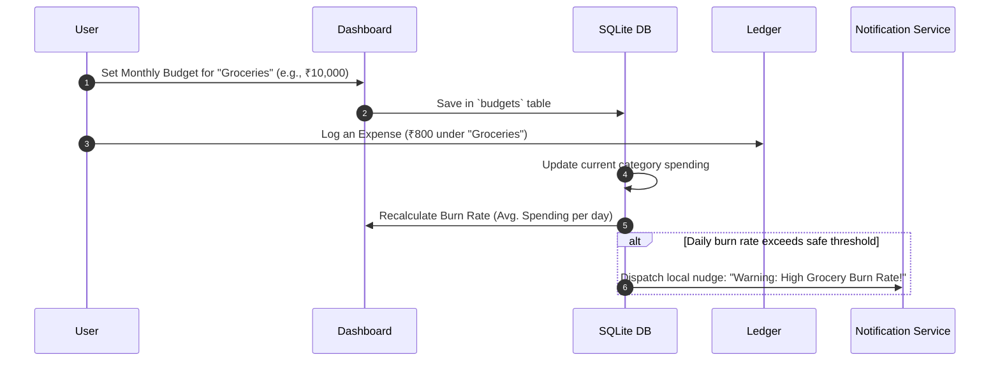
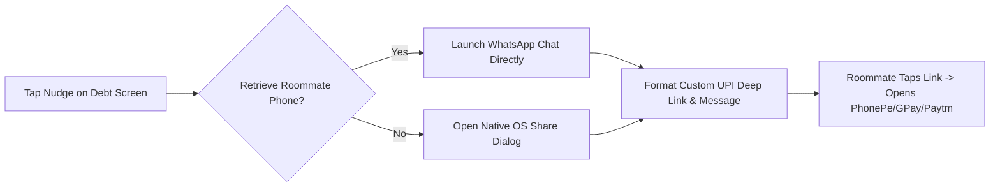
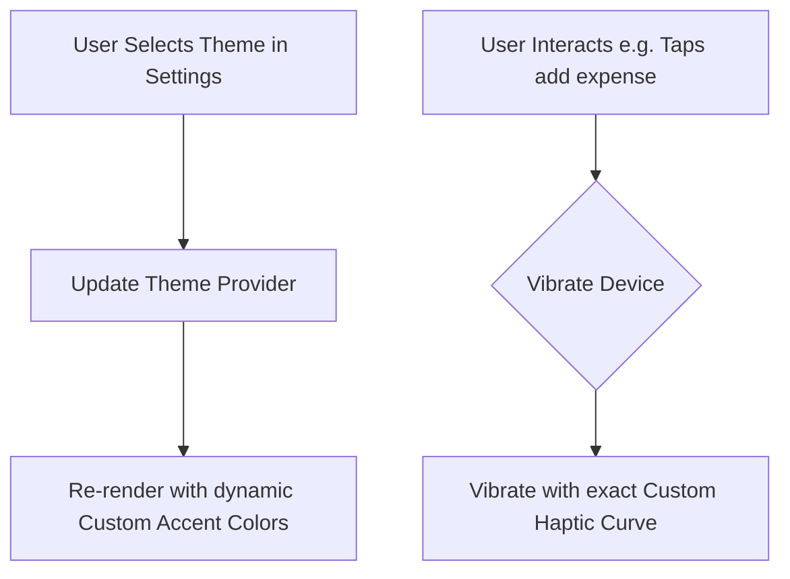
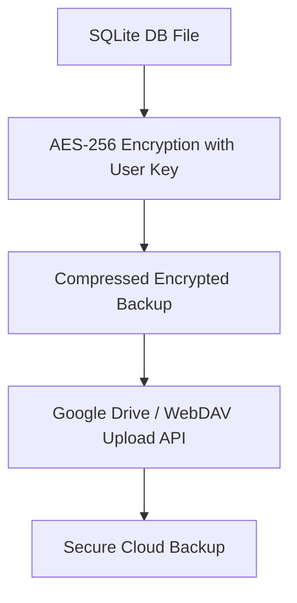
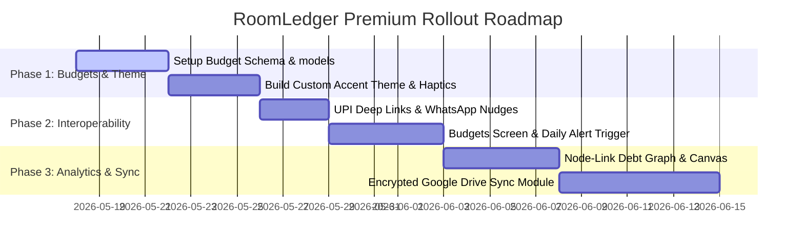

# 🟢 RoomLedger Premium Roadmap & Engineering Plan

Welcome to the **RoomLedger Premium Roadmap & Engineering Plan**. This plan outlines a suite of state-of-the-art, high-value improvements and advanced features designed to elevate **RoomLedger** into a world-class, premium app, while keeping its core philosophy intact: **pure AMOLED aesthetics, 100% offline local privacy, and integer-exact mathematical safety.**

---

## 🧭 Architectural Core & Philosophy

All improvements and new features must conform strictly to RoomLedger's three pillars:

```mermaid
graph TD
    classDef primary fill:#10B981,stroke:#047857,color:#ffffff,stroke-width:2px;
    classDef secondary fill:#1E293B,stroke:#0F172A,color:#94A3B8,stroke-width:1px;
    
    A[RoomLedger Pillars] ::: primary
    A --> B[1. AMOLED-First Design] ::: secondary
    A --> C[2. 100% Local Privacy] ::: secondary
    A --> D[3. Integer-Exact Financials] ::: secondary

    B1[True black backgrounds, emerald & glass accents] --> B
    C1[No mandatory cloud databases, offline-first SQLite] --> C
    D1[All currencies scaled to integer cents/paise] --> D
```

---

## 🗺️ Feature Roadmap Matrix

The following matrix categorizes planned enhancements by tier, implementation complexity, and target components.

| Feature Area | Description | Priority | Complexity | Primary Target Files / Folders |
| :--- | :--- | :---: | :---: | :--- |
| **📈 Smart Budgeting** | Add a Category-wise Budget Planner with Smart daily Burn Rate threshold alerts. | **HIGH** | Medium | [lib/features/personal_expenses/](file:///home/manish/Projects/roomledger/lib/features/personal_expenses), [notification_service.dart](file:///home/manish/Projects/roomledger/lib/features/reminders/services/notification_service.dart) |
| **🔗 UPI Deep-Link Nudges** | WhatsApp/SMS debt reminders with instant UPI redirect deep links. | **HIGH** | Low | [debts_screen.dart](file:///home/manish/Projects/roomledger/lib/features/debts/debts_screen.dart), [friends_repository.dart](file:///home/manish/Projects/roomledger/lib/features/friends/data/friends_repository.dart) |
| **🎨 Accent Theming Engine** | Selectable accent colors (Teal, Neon Emerald, Amber Glow) and premium custom haptic curves. | **MEDIUM** | Low | [app_theme.dart](file:///home/manish/Projects/roomledger/lib/core/theme/app_theme.dart), [roomledger_app.dart](file:///home/manish/Projects/roomledger/lib/app/roomledger_app.dart) |
| **☁️ Encrypted Private Sync** | Automatic encrypted backup synchronization via user's private Google Drive. | **MEDIUM** | High | [backup_restore_repository.dart](file:///home/manish/Projects/roomledger/lib/features/backup_restore/data/backup_restore_repository.dart) |
| **📊 Node-Link Debt Chart** | Interactive graph view in Analytics showing the direct cash flow map of roommates. | **LOW** | Medium | [analytics_screen.dart](file:///home/manish/Projects/roomledger/lib/features/analytics/analytics_screen.dart) |

---

## 💎 Deep Feature Specifications & Implementation Details

---

### Spec 1: Shared Budget Planner & Smart Burn Rate Alerts
**Goal:** Implement a local-first category and monthly budgeting manager. Users can define spending thresholds. The app calculates real-time burn rates (average daily spending) and uses a smooth visual indicator on the dashboard (e.g., glassmorphic gradient ring) along with automated push notifications via `NotificationService` when thresholds are crossed.



#### 🗄️ SQLite Schema Extension
Add this table in [roomledger_database.dart](file:///home/manish/Projects/roomledger/lib/core/database/roomledger_database.dart) under a database version upgrade:

```sql
-- Schema version upgrade (v7)
CREATE TABLE budgets (
  id INTEGER PRIMARY KEY AUTOINCREMENT,
  category TEXT NOT NULL UNIQUE, -- 'Groceries', 'Rent', etc. or 'Overall'
  monthly_limit INTEGER NOT NULL, -- Scaled integer (paise/cents)
  created_at TEXT NOT NULL
);
```

#### 🛠️ Implementation Steps
1. **Domain Models:** Create `Budget` entities under `lib/features/personal_expenses/domain/`.
2. **Data Layer:** Build a budget provider to fetch category spending totals and compare them to the budgeted limit.
3. **Background Alerts:** Integrate a daily check inside the existing `BackgroundReminderTask` that calculates the current day's progress and sends a local push notification if spending exceeds 85% of the threshold or daily projection rates.
4. **UI Layout:** A gorgeous circular ring visualizer at the top of the Dashboard Screen showing category usage percentages.

---

### Spec 2: Smart UPI-Deep Link Sharing & WhatsApp "Debt Nudges"
**Goal:** Expand [debts_screen.dart](file:///home/manish/Projects/roomledger/lib/features/debts/debts_screen.dart) and [reminders_screen.dart](file:///home/manish/Projects/roomledger/lib/features/reminders/reminders_screen.dart) to generate instant deep-link payment requests. Users can tap a teammate, generate a quick WhatsApp "Nudge" incorporating their UPI ID, payee name, and exact integer amount.



#### 🌐 Technical Schema of the UPI Deep Link
Format the UPI pay link dynamically by parsing the roommate's outstanding balance:
```
upi://pay?pa=YOUR_UPI_ID@okaxis&pn=YOUR_NAME&am=OUTSTANDING_AMOUNT&cu=INR&tn=RoomLedgerSettlement
```

#### ✍️ Formatted Message Template
```text
Hey *Roommate*, here is a friendly nudge from RoomLedger! 💚
My outstanding balance is ₹*125.00*.

Tap below to settle instantly using any UPI app:
🔗 upi://pay?pa=manish@okaxis&pn=Manish&am=125.00&cu=INR
```

#### 🛠️ Implementation Steps
1. **Phone Integration:** Update the Roommate schema in [roomledger_database.dart](file:///home/manish/Projects/roomledger/lib/core/database/roomledger_database.dart) and roommate creation flow to support adding a mobile number.
2. **Deep-Link Generator:** Create `lib/core/utils/upi_utils.dart` to calculate outstanding amounts (e.g. dividing by 100 to get decimal representation for payment apps) and build custom UPI links.
3. **Trigger:** Add a fast-action "Nudge" button inside the debt list tiles that utilizes `url_launcher` to redirect straight to WhatsApp.

> [!WARNING]
> UPI deep links are strictly formatted and do not tolerate floating-point drift. Ensure you construct the `&am=` string precisely by dividing the base integer cents/paise by `100.0` and rounding to exactly two decimal places!

---

### Spec 3: Custom AMOLED Accent Theming & Micro-Interaction Engine
**Goal:** Elevate RoomLedger's premium dark aesthetics by introducing a high-fidelity customization module. Users can select dynamic AMOLED accent highlights (e.g., Neon Mint, Cyberpunk Crimson, Violet Glow, Sunset Bronze) and enjoy highly tuned haptic feedback profiles that correspond to different user interactions.



#### 🎨 Elite AMOLED Palettes
- **Pure Noir:** `#000000` (Background) | `#10B981` (Accent Emerald)
- **Cyberpunk Dark:** `#000000` (Background) | `#EF4444` (Accent Crimson)
- **Deep Orchid:** `#000000` (Background) | `#A78BFA` (Accent Purple)
- **Electric Ocean:** `#000000` (Background) | `#3B82F6` (Accent Indigo)

#### 📳 Interactive Haptic Profiles
- **Quick Tap:** Gentle feedback on selecting categories (medium impact).
- **Successful Save:** Harmonic double-pulse haptics on saving expenses.
- **Form Error:** Rapid triple-pulsed warning vibration on input errors.

---

### Spec 4: Encrypted Private Cloud Sync (Google Drive / WebDAV)
**Goal:** While remaining strictly offline-first, enable optional automated background synchronization to the user's private Google Drive storage space. Files are encrypted with a custom, user-provided local master key before sync, guaranteeing that no developer or third party can access private transaction files.



#### 🔒 Cryptographic Safety
- Use the standard `encrypt` package in Flutter.
- Leverage **PBKDF2** key derivation from the user's master password.
- Run the backup as a low-priority background task scheduled via the existing `workmanager` library.

---

### Spec 5: Rich Interactive Analytics & Node-Link Debt Visualizer
**Goal:** Upgrade [analytics_screen.dart](file:///home/manish/Projects/roomledger/lib/features/analytics/analytics_screen.dart) to include a dynamic visualization layout depicting who owes whom. Using customized canvas animations or a specialized chart, render roommate relationships as physical nodes, with arrows sized proportionally to the size of the debts.

```mermaid
graph TD
    classDef friend fill:#0D9488,stroke:#0F766E,color:#ffffff;
    
    A[Manish] ::: friend -- "₹450" --> B[Amit] ::: friend
    B -- "₹120" --> C[Rahul] ::: friend
    C -- "₹300" --> A
```

- **Interactive Hover & Highlight:** Tap any roommate's node to isolate their specific transactions, highlighting inflows (credits) in emerald and outflows (debts) in warning orange.
- **Auto-simplification Engine:** Run a simple offline solver algorithm (similar to Splitwise) to automatically simplify complex circular debts (e.g. if A owes B, B owes C, and C owes A, resolve it to single transfers).

---

## 🧪 Testing & CI/CD Quality Blueprint

To ensure that the financial system remains 100% stable during the addition of these advanced features:

> [!IMPORTANT]
> **No Float Drift Rule:** All unit tests must include strict assertions that guard against float conversion hazards.

### 🧪 Unit Testing Core Financial Calculations
```dart
group('RoomLedger Integer Safety Tests', () {
  test('Splitting ₹100.00 among 3 participants leaves no remainder leaks', () {
    final input = AddSplitExpenseInput(
      note: 'Grocery bill',
      category: 'Groceries',
      totalAmount: 10000, // ₹100.00
      participantIds: [2, 3], // 2 friends
      splitWithSelf: true,   // total 3 people
    );
    
    final shares = input.calculateShares();
    final totalSum = shares.reduce((a, b) => a + b);
    
    // Assertion: Sum must precisely equal original 10000 paise/cents
    expect(totalSum, equals(10000));
    // Assertion: Distribution should be [3334, 3333, 3333]
    expect(shares, containsAllInOrder([3334, 3333, 3333]));
  });
});
```

---

## 📈 Implementation Sequence & Schedule

To successfully roll out these premium additions, follow this incremental development cadence:



---

*This document was drafted specifically to guide development updates in the **RoomLedger** repository. Please consult these specifications prior to introducing any changes to existing database files or provider layers.*
